 

  

*"every elegant solution eventually creates a new, much worse problem."*

 

<h2></h2>

i build weird software to kill time, and sometimes it turns into something useful.

away from the keyboard: cats (i photograph them and collect cat facts), doodling, and soup. i make a lot of soup. *(yes, souphater.page. no, i don't hate soup.)*

<h2></h2>

| project | what it does | stack | status |
|:--|:--|:--|:--|
| [**ditto**](https://github.com/walsoup/ditto) | record a voice note on android and it lands in whatever chat you're in. typing on glass sucks. |  |  |
| [**fichegen**](https://github.com/walsoup/Fichegen) | lesson prep for teachers, written by an llm so you don't have to. native macos app on `main`, a [windows build](https://github.com/walsoup/Fichegen/tree/windows-native) on its own branch, original python script in history. |   |  |
| [**intel-arc-llm**](https://github.com/walsoup/intel-arc-llm) | local llm inference tuned for intel arc igpus: vulkan, dp4a, speculative decoding. |  |  |
| [**gemwallet**](https://github.com/walsoup/gemwallet) | finance tracker for android. encrypted local db, no telemetry, works offline. optional api if you want sync. |  |  |
| [**agent-base**](https://github.com/walsoup/agent-base) | a small agent loop with streaming, reasoning logs and human approval. |  |  |
| [**bitnet**](https://github.com/walsoup/bitnet) | android bluetooth mesh, plus internet sharing over bluetooth without root. |  |  |

> bitnet will break on you. that's the honest status.

 

<h2></h2>

| project | what it does |
|:--|:--|
| [**tether-compass**](https://github.com/walsoup/tether-compass) | a web compass for long-distance couples. it lights up when you're facing each other. |
| [**discord-mcp**](https://github.com/walsoup/discord-mcp) | an mcp server so an ai can read and talk in discord. |
| [**DirectMoutamadris**](https://github.com/walsoup/DirectMoutamadris) | check your moroccan grades without waiting on the slow portal. |

 

<h2></h2>

| what | which |
|:--|:--|
| **languages** |       |
| **runs on** |      |
| **focus** | offline protocols, audio dsp, agentic tooling, mobile ux |

<h2></h2>

 

